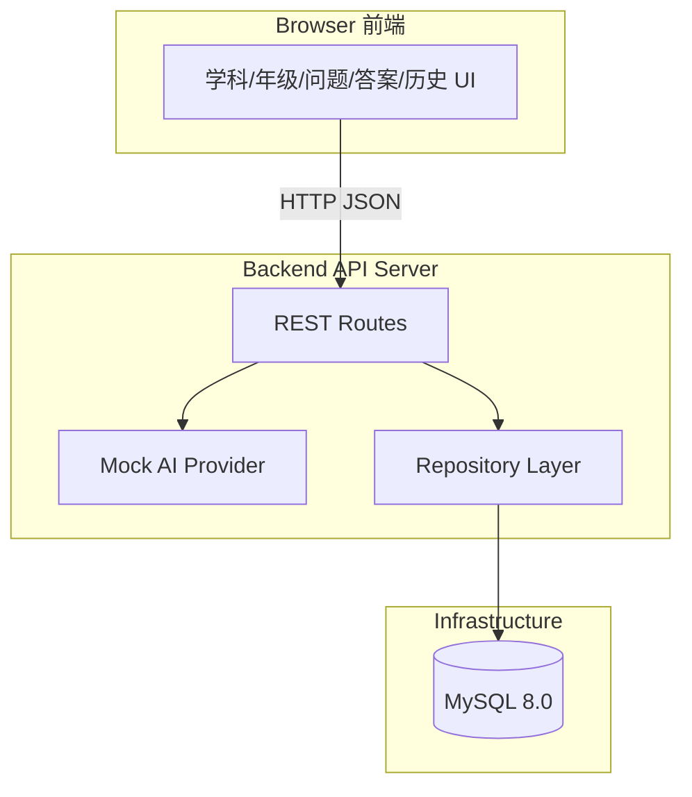
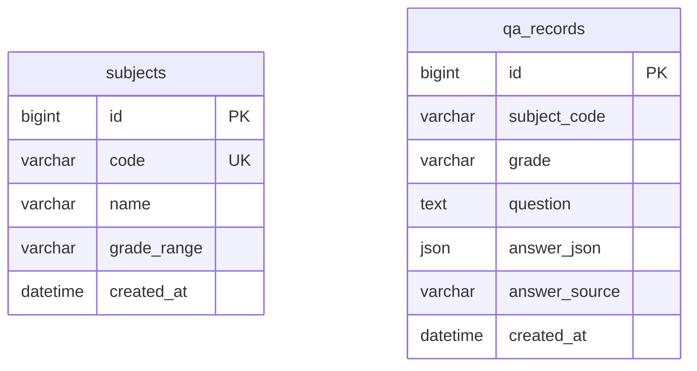
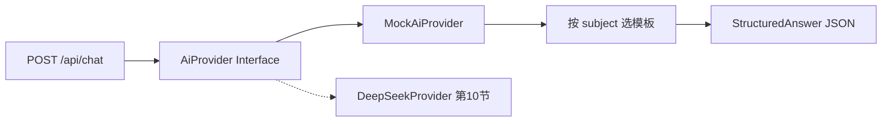

# Design：高中学科知识 AI 网站 MySQL/Git MVP

## 1. 架构概览



### 1.1 设计原则

- **API 优先**：前端只依赖 HTTP 契约（见 `docs/api.md`），不嵌入 AI 逻辑。
- **Provider 可替换**：Mock AI 封装为独立模块，第 10 节仅替换 Provider 实现。
- **薄控制器、厚领域**：路由负责校验与编排；生成答案、持久化各自独立。
- **无敏感数据**：不设计用户表；`qa_records` 仅存学科、年级、问题与答案 JSON。

### 1.2 推荐目录结构

```
.
├── docker-compose.yml
├── sql/
│   └── init.sql                 # 建表 + 初始 subjects 数据
├── docs/
│   ├── api.md
│   └── opsx/                    # proposal / design / tasks / acceptance
├── backend/
│   ├── package.json 或 requirements.txt
│   ├── .env.example             # 数据库连接示例，不含 AI Key
│   └── src/
│       ├── app.js 或 main.py
│       ├── routes/
│       │   ├── subjects.js
│       │   ├── chat.js
│       │   └── history.js
│       ├── services/
│       │   ├── mockAi.js        # 第 9 节
│       │   └── aiProvider.js    # 第 10 节抽象入口（可先 stub）
│       ├── repositories/
│       │   ├── subjectRepo.js
│       │   └── qaRecordRepo.js
│       └── db/
│           └── pool.js
└── frontend/
    ├── index.html
    ├── css/
    └── js/
        ├── api.js               # 封装 fetch
        ├── chat.js
        └── history.js
```

具体语言栈以课程要求为准；上述结构体现 **前后端分离 + 分层** 意图。

---

## 2. 数据模型

### 2.1 ER 关系



`qa_records.subject_code` 逻辑关联 `subjects.code`，第 9 节可不建外键以降低复杂度；第 10 节可按需补充。

### 2.2 表结构（与现有实践对齐）

**subjects**

| 字段 | 类型 | 说明 |
|------|------|------|
| `id` | BIGINT PK AI | 主键 |
| `code` | VARCHAR(30) UNIQUE | 学科代码：`math` / `english` / `physics` |
| `name` | VARCHAR(50) | 显示名称：数学 / 英语 / 物理 |
| `grade_range` | VARCHAR(50) | 如 `高一-高三` |
| `created_at` | DATETIME | 默认 CURRENT_TIMESTAMP |

**qa_records**

| 字段 | 类型 | 说明 |
|------|------|------|
| `id` | BIGINT PK AI | 主键，作为 API 响应 `id` |
| `subject_code` | VARCHAR(30) | 请求中的 `subject` |
| `grade` | VARCHAR(20) | 如 `高一` |
| `question` | TEXT | 用户问题 |
| `answer_json` | JSON | 完整结构化答案 |
| `answer_source` | VARCHAR(20) | 第 9 节固定 `mock` |
| `created_at` | DATETIME | 历史接口 `createdAt` 来源 |

### 2.3 字段映射（DB ↔ API）

| API 字段 | DB 字段 | 方向 |
|----------|---------|------|
| `code` | `subjects.code` | 读出 |
| `name` | `subjects.name` | 读出 |
| `gradeRange` | `subjects.grade_range` | 读出，snake → camel |
| `subject` | `qa_records.subject_code` | 写入/读出 |
| `grade` | `qa_records.grade` | 写入/读出 |
| `question` | `qa_records.question` | 写入/读出 |
| `answer` | `qa_records.answer_json` | 写入/读出 |
| `source` | `qa_records.answer_source` | 写入/读出 |
| `createdAt` | `qa_records.created_at` | 读出，ISO 8601 |

---

## 3. API 设计

契约详见 `docs/api.md`。此处补充实现要点。

### 3.1 GET /api/subjects

- 从 `subjects` 表查询全部记录，按 `code` 排序。
- 响应 `{ subjects: [...] }`，字段 camelCase。

### 3.2 POST /api/chat

**请求校验**

| 字段 | 规则 |
|------|------|
| `subject` | 必填，非空字符串，建议校验存在于 `subjects` |
| `grade` | 必填，枚举或字符串：`高一` / `高二` / `高三` |
| `question` | 必填，trim 后长度 1–2000 |

**处理流程**

1. 校验请求体 → 400
2. 调用 `MockAiProvider.generate({ subject, grade, question })`
3. `INSERT INTO qa_records (...)`，`answer_source = 'mock'`
4. 返回 `{ id, source: 'mock', answer }`

**Mock AI 输出 Schema（固定，供第 10 节复用）**

```typescript
interface StructuredAnswer {
  summary: string;
  knowledgePoints: string[];
  steps: string[];
  example: { question: string; answer: string };
  reminder: string;
}
```

Mock 实现建议：

- 按 `subject` 选择不同话术模板（数学 / 英语 / 物理）。
- `summary`、`steps` 可含占位或关键词匹配（如「二次函数」→ 顶点式模板）。
- 不调用外部网络。

### 3.3 GET /api/history?limit=5

- 查询参数 `limit`：默认 5，最大 50，非法值回退默认。
- `SELECT ... FROM qa_records ORDER BY created_at DESC LIMIT ?`
- 响应 `{ records: [...] }`，不含完整 `answer`（与 api.md 示例一致）。

---

## 4. Mock AI Provider 设计（第 9 节）



**接口定义（概念层）**

```
generate(input: { subject, grade, question }) → StructuredAnswer
```

第 9 节仅实现 `MockAiProvider`。配置文件或环境变量 `AI_PROVIDER=mock`，为第 10 节预留切换点。

---

## 5. 前端设计

### 5.1 页面区块

| 区块 | 行为 |
|------|------|
| 学科选择 | 页面加载时 `GET /api/subjects` 填充下拉/卡片 |
| 年级选择 | 本地选项：高一 / 高二 / 高三 |
| 问题输入 | 多行文本 + 提交按钮 |
| 答案展示 | 渲染 `summary`、`knowledgePoints`、`steps`、`example`、`reminder` |
| 历史记录 | 初始及每次提交后 `GET /api/history?limit=5` |

### 5.2 前端 API 封装

`frontend/js/api.js` 统一：

- `fetchSubjects()`
- `submitChat({ subject, grade, question })`
- `fetchHistory(limit = 5)`

Base URL 可配置（如 `http://localhost:3000`），开发期注意 CORS。

### 5.3 状态与交互

- 提交中：禁用按钮，显示 loading。
- 错误：展示友好提示（网络错误、校验失败）。
- 成功：滚动至答案区，刷新历史列表。

---

## 6. 配置与安全

### 6.1 环境变量（后端 `.env`，不入库）

```env
DB_HOST=localhost
DB_PORT=3306
DB_USER=subject_user
DB_PASSWORD=subject_pass
DB_NAME=subject_ai
PORT=3000
AI_PROVIDER=mock
# DEEPSEEK_API_KEY=   # 第 10 节才使用，第 9 节留空
```

- `.env` 加入 `.gitignore`
- 提供 `.env.example` 仅含占位符
- **禁止** 在前端、`README` 截图、Git 历史中出现真实 Key

### 6.2 CORS

开发环境允许前端源（如 `http://localhost:5173` 或静态文件服务端口）。

---

## 7. Docker Compose

沿用现有 `docker-compose.yml`：

- 镜像：`mysql:8.0`
- 容器名：`subject_ai_mysql`
- 挂载 volume 持久化数据
- 可选：将 `sql/init.sql` 挂载至 `/docker-entrypoint-initdb.d/` 实现首次自动初始化

**注意**：若本机 3306 已被占用，需停止冲突容器或改 host 端口映射。

---

## 8. Git 策略

### 8.1 分支建议

| 分支 | 用途 |
|------|------|
| `main` | 稳定可演示版本 |
| `feature/backend-api` | 后端 API |
| `feature/frontend-ui` | 前端页面 |
| `feature/mock-ai` | Mock 生成器 |
| `feature/db-init` | SQL 与 Docker 完善 |

练习场景可简化，但 **提交粒度** 应按 `tasks.md` 小步进行。

### 8.2 提交信息约定

```
docs: add api specification
chore: add docker compose for mysql
feat: add subjects list endpoint
feat: add mock ai provider
feat: add chat endpoint with db persist
feat: add history endpoint
feat: add frontend chat page
```

---

## 9. 第 10 节扩展点（仅设计预留，本期不实现）

| 扩展点 | 说明 |
|--------|------|
| `DeepSeekProvider` | 实现同一 `generate()` 接口，输出 `StructuredAnswer` |
| `answer_source` | 写入 `deepseek` |
| Prompt 工程 | 按 subject/grade 构造 system prompt，要求 JSON 输出 |
| 错误降级 | DeepSeek 失败时可返回 502 或 fallback（课程另定） |

接口路径、请求体、响应体 **不变**，前端 **零改动或极少改动**。

---

## 10. 非功能需求

| 项 | 目标 |
|----|------|
| 本地启动 | Docker + 一条后端启动命令 + 打开前端即可演示 |
| 响应时间 | Mock 场景 < 500ms（不含网络） |
| 可维护性 | Mock / DB / Route 分层清晰 |
| 文档 | API、设计、任务、验收四文档齐全 |
