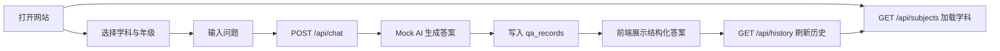

# Proposal：高中学科知识 AI 网站 MySQL/Git MVP

## 1. 背景与动机

高中生在学习数学、英语、物理等学科时，经常需要即时、结构化的讲解——不仅要知道答案，还要理解知识点、步骤和考试注意事项。通用 AI 聊天工具虽然可用，但缺少学科上下文、年级适配和可追溯的历史记录。

本项目面向 **第 9 节课程 MVP**，目标是搭建一个最小可用的学习辅助网站：前端完成交互，后端统一提供 API，MySQL 持久化数据，Git 管理开发过程。第 9 节使用 **Mock AI** 模拟回复；第 10 节将在 **不改变接口结构** 的前提下，将 Mock 替换为 DeepSeek。

## 2. 项目目标

### 2.1 用户价值

- 高中生可按 **学科 + 年级** 提问，获得 **结构化答案**（摘要、知识点、步骤、例题、提醒）。
- 可查看 **最近问答历史**，便于复习与对照。
- 无需注册登录，降低使用门槛。

### 2.2 技术目标

- 前后端分离：前端只调用后端 REST API，不直接接触 AI Key。
- 后端负责 Mock AI 生成、数据库读写、接口契约稳定。
- Docker Compose 一键启动 MySQL。
- 每完成一个小目标提交一次 Git，形成可回顾的开发轨迹。

## 3. 范围定义

### 3.1 本期包含（第 9 节 MVP）

| 模块 | 内容 |
|------|------|
| 前端 | 学科选择、年级选择、问题输入、结构化答案展示、历史记录列表 |
| 后端 | `GET /api/subjects`、`POST /api/chat`、`GET /api/history?limit=5` |
| 数据 | MySQL 表 `subjects`、`qa_records`；每次 chat 写入记录 |
| AI | Mock AI 生成器（按学科/问题模板返回结构化 JSON） |
| 基础设施 | Docker Compose 启动 MySQL；环境变量管理数据库连接 |
| 文档 | API 文档、本 proposal/design/tasks/验收标准 |

### 3.2 本期不包含

- 真实 DeepSeek API 调用（留至第 10 节）
- 用户登录、注册、权限体系
- 学生姓名、手机号、学校等敏感个人信息采集
- 前端代码中出现 API Key
- 复杂部署（K8s、CI/CD 等）

### 3.3 第 10 节预留

- 后端增加 AI Provider 抽象层：`MockProvider` → `DeepSeekProvider`
- 接口路径、请求体、响应体 **保持不变**
- `qa_records.answer_source` 由 `mock` 扩展为 `mock | deepseek`

## 4. 已有基础（仓库现状）

以下内容已在练习过程中部分完成，后续开发应在此基础上继续，避免重复劳动：

| 资产 | 状态 | 说明 |
|------|------|------|
| `README.md` | 已有 | 项目简介与 MVP 范围 |
| `docker-compose.yml` | 已有 | MySQL 8.0，库 `subject_ai`，用户 `subject_user` |
| `docs/api.md` | 已有 | 三个 API 的请求/响应契约 |
| MySQL 表 | 已手动初始化 | `subjects`、`qa_records` 及初始学科数据（需固化为 `sql/init.sql`） |
| Git 分支 | 已有 | `main`、`feature/subject-english` 等练习提交 |

## 5. 核心用户流程

## 6. 成功标准（概要）

- 三个 API 按 `docs/api.md` 契约可用。
- 每次提问均持久化到 `qa_records`，`answer_source = 'mock'`。
- 前端完整走通「选题 → 提问 → 看答案 → 看历史」闭环。
- Mock AI 仅存在于后端，前端与 Git 仓库中无 API Key。
- 开发过程有清晰、小步的 Git 提交记录。

详细验收条目见 `acceptance.md`。

## 7. 风险与应对

| 风险 | 影响 | 应对 |
|------|------|------|
| 3306 端口被占用 | MySQL 容器无法启动 | 文档说明停旧容器或改映射端口 |
| Mock 与 DeepSeek 响应结构不一致 | 第 10 节替换困难 | 第 9 节严格按 `answer` JSON Schema 实现 Mock |
| 前后端字段命名不一致 | 联调失败 | 统一 camelCase 对外、snake_case 对内映射 |
| 一次性提交过大 | Git 练习价值降低 | 按 `tasks.md` 拆分，每步一 commit |

## 8. 建议技术选型（待 design 细化）

- **前端**：静态 HTML + 原生 JS，或 Vite + 轻量框架（以课程要求为准）
- **后端**：Node.js（Express/Fastify）或 Python（FastAPI），优先与课程栈一致
- **数据库**：MySQL 8.0（Docker Compose）
- **版本管理**：Git，约定式提交（`feat:`、`docs:`、`chore:` 等）

## 9. 交付物清单

1. 可运行的前后端项目代码
2. `docker-compose.yml` + `sql/init.sql`
3. `docs/api.md`（接口契约，已有）
4. 本目录下 proposal / design / tasks / acceptance 四份文档
5. Git 提交历史，体现分步开发过程

## 10. 下一步

阅读 `design.md` 了解架构与数据模型，按 `tasks.md` 顺序实施，最终以 `acceptance.md` 逐项验收。
