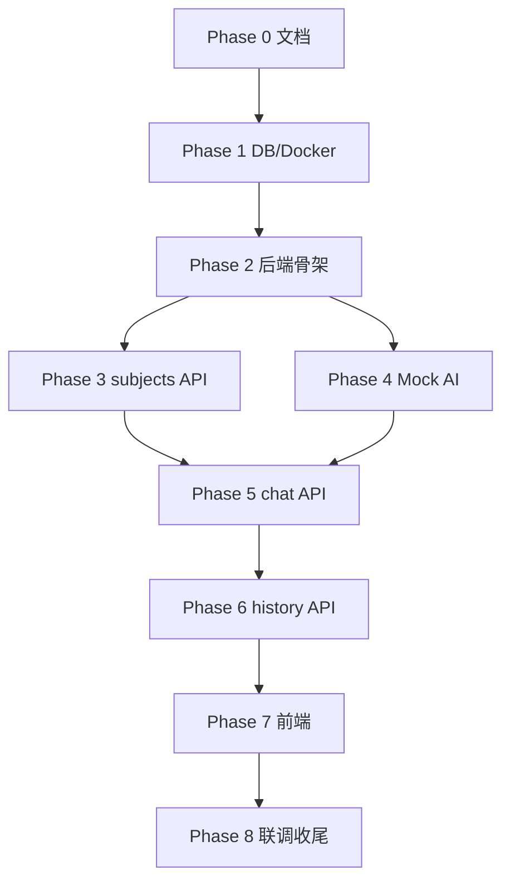

# Tasks：高中学科知识 AI 网站 MySQL/Git MVP

按顺序执行；**每完成一个任务块，提交一次 Git**。提交信息参考各任务建议的 commit message。

---

## Phase 0：文档与规划（当前阶段）

| # | 任务 | 产出 | 建议 commit |
|---|------|------|-------------|
| 0.1 | 编写 proposal | `docs/opsx/proposal.md` | `docs: add project proposal` |
| 0.2 | 编写 design | `docs/opsx/design.md` | `docs: add technical design` |
| 0.3 | 编写 tasks | `docs/opsx/tasks.md` | `docs: add development tasks` |
| 0.4 | 编写验收标准 | `docs/opsx/acceptance.md` | `docs: add acceptance criteria` |
| 0.5 | 确认 API 契约 | 核对 `docs/api.md` 与 design 一致 | `docs: align api spec`（如有改动） |

---

## Phase 1：数据库与 Docker

| # | 任务 | 产出 | 建议 commit |
|---|------|------|-------------|
| 1.1 | 固化 SQL 初始化脚本 | `sql/init.sql`（建表 + 插入 math/english/physics） | `chore: add mysql init sql` |
| 1.2 | 完善 Docker Compose | 可选挂载 init.sql；README 补充启动说明 | `chore: wire mysql init in compose` |
| 1.3 | 验证 MySQL 可连接 | `docker compose up -d` 成功，表与种子数据存在 | `chore: verify mysql setup`（或合入 1.2） |
| 1.4 | 补充 `.gitignore` | 忽略 `.env`、`node_modules` 等 | `chore: add gitignore` |

**1.1 验收要点**：重复执行 init 脚本不报错（`IF NOT EXISTS`）；`subjects` 含 3 条记录。

---

## Phase 2：后端骨架

| # | 任务 | 产出 | 建议 commit |
|---|------|------|-------------|
| 2.1 | 初始化后端项目 | `backend/` 目录、依赖、启动入口 | `feat: scaffold backend project` |
| 2.2 | 数据库连接池 | 读取 `.env`，连接 MySQL | `feat: add database connection` |
| 2.3 | 健康检查 | `GET /health` 或 `/api/health` 返回 ok | `feat: add health check endpoint` |
| 2.4 | 环境变量模板 | `backend/.env.example` | `chore: add env example` |

---

## Phase 3：后端 API — subjects

| # | 任务 | 产出 | 建议 commit |
|---|------|------|-------------|
| 3.1 | Subject Repository | 查询全部 subjects | `feat: add subject repository` |
| 3.2 | GET /api/subjects | 返回 camelCase JSON，符合 api.md | `feat: add subjects list endpoint` |
| 3.3 | 手动测试 | curl 或 HTTP 客户端验证 | （可合入 3.2，不单独 commit） |

---

## Phase 4：Mock AI Provider

| # | 任务 | 产出 | 建议 commit |
|---|------|------|-------------|
| 4.1 | 定义 StructuredAnswer 结构 | 与 api.md / design 一致 | `feat: define structured answer schema` |
| 4.2 | 实现 MockAiProvider | 按 subject 返回不同模板内容 | `feat: add mock ai provider` |
| 4.3 | 单元或脚本测试 | 对 math/english/physics 各测一条 | `test: add mock ai smoke test`（可选） |

---

## Phase 5：后端 API — chat

| # | 任务 | 产出 | 建议 commit |
|---|------|------|-------------|
| 5.1 | QA Record Repository | insert + findRecent | `feat: add qa record repository` |
| 5.2 | 请求校验 | subject / grade / question 必填与格式 | `feat: add chat request validation` |
| 5.3 | POST /api/chat | Mock 生成 → 写库 → 返回 id/source/answer | `feat: add chat endpoint with db persist` |
| 5.4 | 验证持久化 | 调用后 `qa_records` 新增一行，`answer_source=mock` | （合入 5.3） |

---

## Phase 6：后端 API — history

| # | 任务 | 产出 | 建议 commit |
|---|------|------|-------------|
| 6.1 | GET /api/history | 支持 `limit`，默认 5，按时间倒序 | `feat: add history endpoint` |
| 6.2 | 响应字段映射 | `createdAt` ISO 8601，`source` 来自 answer_source | （合入 6.1） |

---

## Phase 7：前端

| # | 任务 | 产出 | 建议 commit |
|---|------|------|-------------|
| 7.1 | 页面骨架 | `frontend/index.html` 布局五区块 | `feat: add frontend page layout` |
| 7.2 | API 封装 | `frontend/js/api.js` | `feat: add frontend api client` |
| 7.3 | 加载学科列表 | 调用 GET /api/subjects | `feat: load subjects on page init` |
| 7.4 | 年级选择与表单 | 下拉 + 问题输入 + 提交 | `feat: add grade and question form` |
| 7.5 | 提交问题 | POST /api/chat，loading / 错误态 | `feat: submit question to chat api` |
| 7.6 | 结构化答案展示 | 渲染 summary / steps / example 等 | `feat: render structured answer` |
| 7.7 | 历史记录列表 | GET /api/history，提交后刷新 | `feat: add history list panel` |
| 7.8 | 基础样式 | 可读性良好的 CSS | `style: add frontend styles` |

---

## Phase 8：联调与文档收尾

| # | 任务 | 产出 | 建议 commit |
|---|------|------|-------------|
| 8.1 | 端到端联调 | 完整用户流程跑通 | `fix:` 类 commit 修复联调问题 |
| 8.2 | README 更新 | 启动步骤、目录说明、API 链接 | `docs: update readme with setup guide` |
| 8.3 | 合并 feature 分支 | 合并至 `main` | `merge: integrate mvp features` |
| 8.4 | 按 acceptance.md 自检 | 逐项勾选 | — |

---

## Phase 9：第 10 节预留（本期不开发，仅记录）

| # | 任务 | 说明 |
|---|------|------|
| 9.1 | 实现 DeepSeekProvider | 替换 Mock，接口不变 |
| 9.2 | 环境变量 DEEPSEEK_API_KEY | 仅后端，不入库 |
| 9.3 | answer_source = deepseek | 新记录标记来源 |

---

## 任务依赖关系

---

## Git 提交检查清单

每完成一个带「建议 commit」的任务后：

- [ ] `git status` 确认只包含本任务相关文件
- [ ] 本地可运行 / 可验证（如适用）
- [ ] commit message 清晰描述「为什么」
- [ ] 不包含 `.env`、API Key、本地临时文件

---

## 预估工作量（参考）

| Phase | 预估 |
|-------|------|
| 0 文档 | 已完成 |
| 1 DB/Docker | 0.5–1h |
| 2–6 后端 | 3–5h |
| 7 前端 | 2–4h |
| 8 联调 | 1–2h |

实际以课程节奏为准；优先保证 **小步提交** 与 **验收标准通过**。
